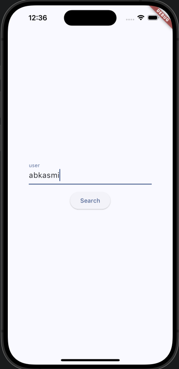
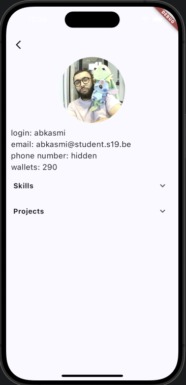
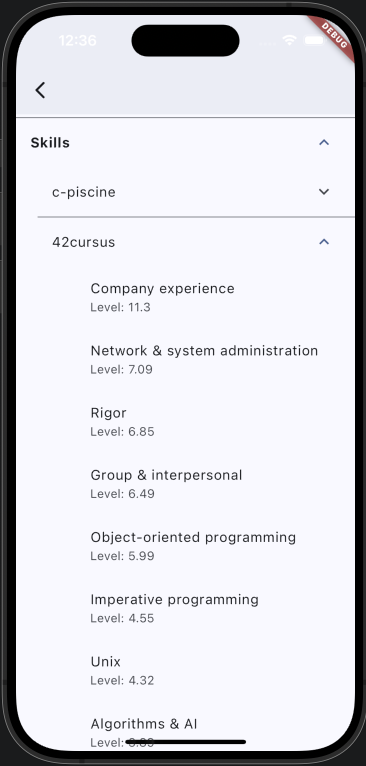
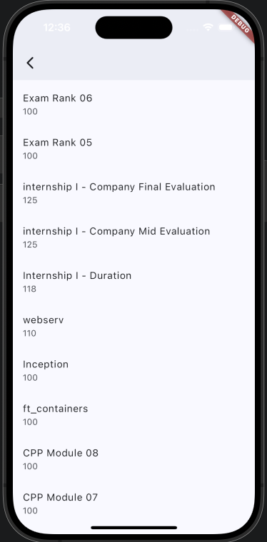

# swifty_companion

The aim of the project is to build an application that will retrieve the information of 42 students,
using the 42 API.

The first view serve as the entry point, while the second view is dedicated to displaying detailed login information, provided if the login exists.
The second view will show four details about the user, their login, email, phone number and number of Alterian dollars along with the user's profile picture. Under it you have the user's skills, including their levels and corresponding percentages. The application also list the projects the user has completed, including any that have failed.
You can also navigate back to the first view from the second view.

## How to use it?

First of all you must have Flutter and XCode or Android Studio installed on your system (if not you can refer to `https://docs.flutter.dev/get-started/install`). When your environment is ready go on your intra and generate an api key following 42api documentatiom. You can now create an .env file at the root following the .env.exemple file present. When you are done with this just run `flutter run` at the root and enjoy the app.

## How it looks like

     

